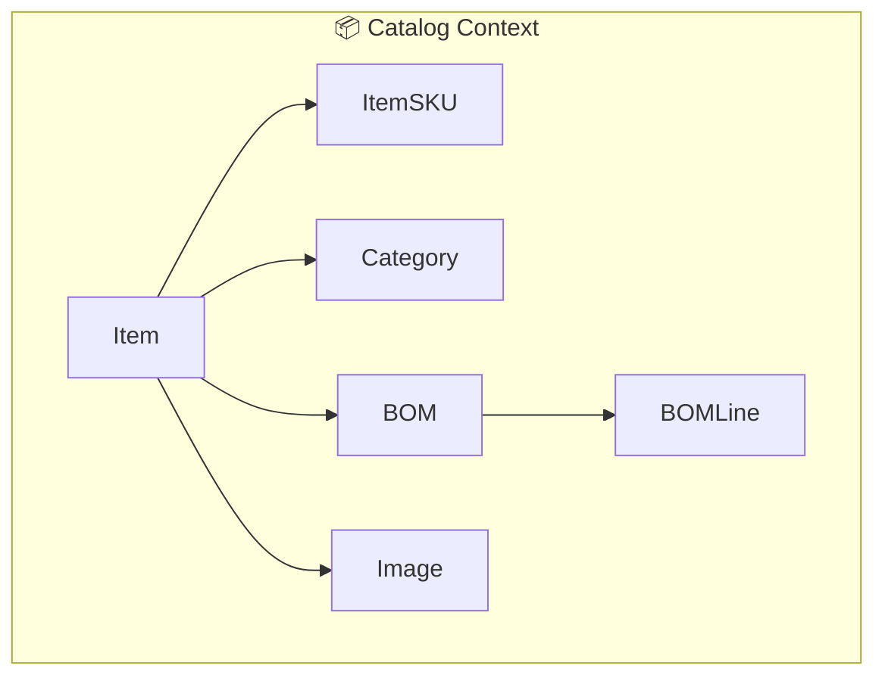

# Catalog Context Domain Diagram (Context Map View)

## Features / Capabilities

- จัดการข้อมูลสินค้า (Item) และรายละเอียดสินค้า
- จัดการรหัสสินค้า (ItemSKU) สำหรับการอ้างอิงและเชื่อมโยงกับระบบอื่น
- จัดการหมวดหมู่สินค้า (Category) และโครงสร้างหมวดหมู่
- จัดการ BOM (Bill of Materials) สำหรับสินค้าที่มีโครงสร้างประกอบ
- จัดการ BOMLine สำหรับรายละเอียดส่วนประกอบใน BOM
- จัดการรูปภาพสินค้า (Image)
- รองรับการเชื่อมโยงข้อมูลกับ context อื่น เช่น Inventory, Procurement, Production

> หมายเหตุ: โครงสร้างนี้เป็น context map เฉพาะ Catalog Context และความสัมพันธ์กับ context อื่น ๆ ที่เกี่ยวข้อง สามารถปรับแต่งเพิ่มเติมได้ตามรายละเอียด domain จริง
