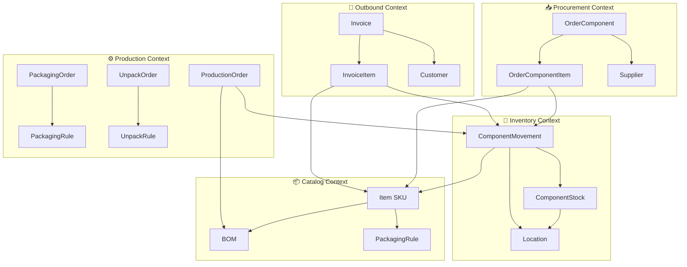

```mermaid

flowchart TB
  %% Catalog Context
  subgraph Catalog [📦 Catalog Context]
    item[Item SKU]
    bom[BOM]
    pkg[PackagingRule]
    item --> bom
    item --> pkg
  end

  %% Procurement Context
  subgraph Procurement [📥 Procurement Context]
    orderComp[OrderComponent]
    orderItem[OrderComponentItem]
    supplier[Supplier]
    orderComp --> orderItem
    orderComp --> supplier
    orderItem --> item
  end

  subgraph Production [⚙️ Production Context]
    productionOrder[ProductionOrder]
    packagingOrder[PackagingOrder]
    unpackOrder[UnpackOrder]
    bom[BOM]
    packagingRule[PackagingRule]
    unpackRule[UnpackRule]
    productionOrder --> bom
    packagingOrder --> packagingRule
    unpackOrder --> unpackRule
  end
  

  %% Outbound Context
  subgraph Outbound [🧾 Outbound Context]
    invoice[Invoice]
    invoiceItem[InvoiceItem]
    customer[Customer]
    invoice --> invoiceItem
    invoice --> customer
    invoiceItem --> item
  end

  %% Inventory Context
  subgraph Inventory [🏬 Inventory Context]
    stock[ComponentStock]
    movement[ComponentMovement]
    location[Location]
    movement --> stock
    stock --> location
    movement --> location
    movement --> item
  end

  %% Cross-context Movements
  orderItem --> movement
  productionOrder --> movement
  invoiceItem --> movement


```