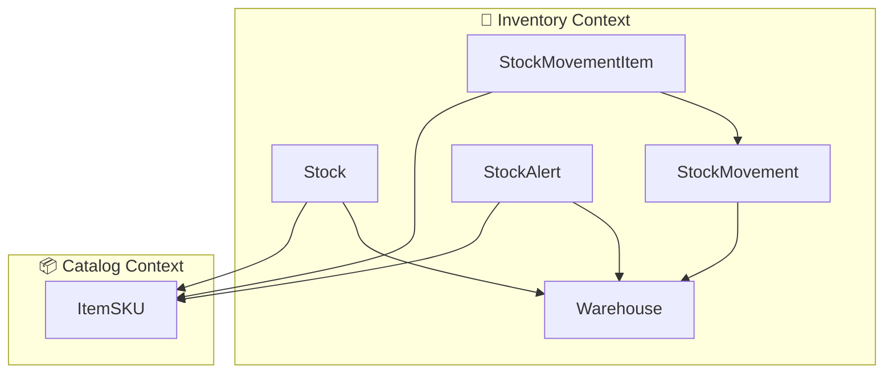

# Inventory Context Domain Diagram (Context Map View)

## Features / Capabilities

- จัดการคลังสินค้า (Warehouse) และข้อมูลสถานที่จัดเก็บ
- บันทึกและติดตามคงคลังสินค้า (Stock) ตาม lot, expiry, warehouse
- บันทึกและติดตามการเคลื่อนไหวสต็อก (StockMovement, StockMovementItem) ทั้งรับเข้า-จ่ายออก
- กำหนดและแจ้งเตือนปริมาณคงคลังต่ำ (StockAlert)
- รองรับการเชื่อมโยงกับข้อมูลสินค้า (ItemSKU) จาก Catalog Context

> หมายเหตุ: โครงสร้างนี้เป็น context map เฉพาะ Inventory Context และ entity ภายใน สามารถปรับแต่งเพิ่มเติมได้ตามรายละเอียด domain จริง
