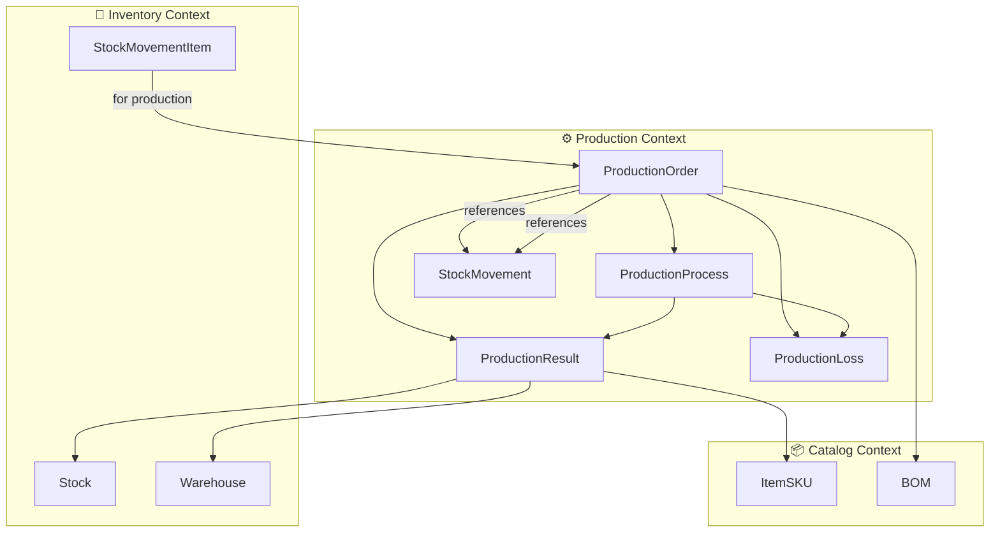

# Production Context Domain Diagram (Context Map View)

```mermaid
flowchart TB
  %% Production Context

  subgraph Production [⚙️ Production Context]
    productionOrder[ProductionOrder]
    productionProcess[ProductionProcess]
    productionResult[ProductionResult]
    productionLoss[ProductionLoss]
    productionOrder --> productionProcess
    productionOrder --> productionResult
    productionOrder --> productionLoss
    productionOrder -- "references" --> stockMovement[StockMovement]
    productionProcess --> productionResult
    productionProcess --> productionLoss
  end


  %% Inventory Context (reference only)
  subgraph Inventory [🏬 Inventory Context]
    stock[Stock]
    warehouse[Warehouse]
    stockMovement[StockMovement]
    stockMovementItem[StockMovementItem]
  end

  %% Catalog Context (reference only)
  subgraph Catalog [📦 Catalog Context]
    itemSKU[ItemSKU]
    bom[BOM]
  end

  %% Cross-context relations
  productionOrder -- "references" --> stockMovement
  stockMovementItem -- "for production" --> productionOrder
  productionResult --> stock
  productionResult --> itemSKU
  productionResult --> warehouse
  productionOrder --> bom
```

> หมายเหตุ: โครงสร้างนี้เป็น context map เบื้องต้น สามารถปรับแต่งเพิ่มเติมได้ตามรายละเอียด domain จริง
