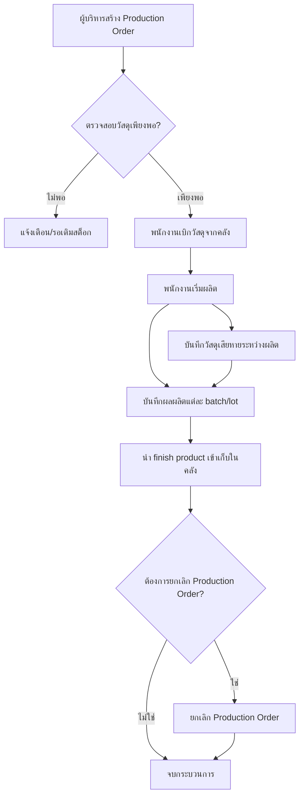

# Production Context Features

- ผู้บริหารทำการสร้าง Production Order
- พนักงานทำการเบิกวัสดุจากคลัง สามารถเบิกได้ตามจำนวนที่ต้องการ ไม่ต้องเบิกทั้งหมดก็ได้ แต่ต้องอ้างอิงการเบิกว่าเป็นการเบิกเพื่อทำ production
- พนักงานทำการผลิต
- พนักงานทำการนำ finish product เข้าเก็บในคลัง โดยอิง production id
- มีการบันทึกวัสดุที่เสียหายระหว่างผลิต
- ผู้บริหารสามารถดูได้ว่าคำสั่งผลิตนี้มีวัสดุเพียงพอไหม
- ผู้บริหารสามารถดูความเคลื่อนไหวของการผลิตว่ามีการเบิกวัสดุไปเท่าไหร่และแต่ละวันมี finish product เท่าไหร่
- สามารถยกเลิกคำสั่งผลิตได้แม้มีการเริ่มผลิตไปแล้ว

# ข้อเสนอแนะเพิ่มเติม
- รองรับการ track สถานะของ Production Order (Created, In Progress, Completed, Cancelled)
- บันทึกเวลาที่เริ่มและสิ้นสุดการผลิตแต่ละ batch/lot
- รองรับการแนบไฟล์หรือบันทึกหมายเหตุ (เช่น ปัญหาที่พบระหว่างผลิต)
- รองรับการอนุมัติหรือยืนยันการเบิกวัสดุ/รับเข้า finish product (เช่น ต้องมีหัวหน้าตรวจสอบ)
- สามารถย้อนดูประวัติการเปลี่ยนแปลง/แก้ไข Production Order ได้ (audit log)
- รองรับการเชื่อมโยงกับสูตรการผลิต (BOM) เพื่อคำนวณวัสดุที่ควรใช้
- รองรับการบันทึกผลผลิตที่ได้จริงเทียบกับแผน (yield, efficiency)
- แจ้งเตือนเมื่อมีการเบิกวัสดุเกินกว่าที่กำหนดใน BOM หรือเกิน stock

---

## Business Logic Flowchart

