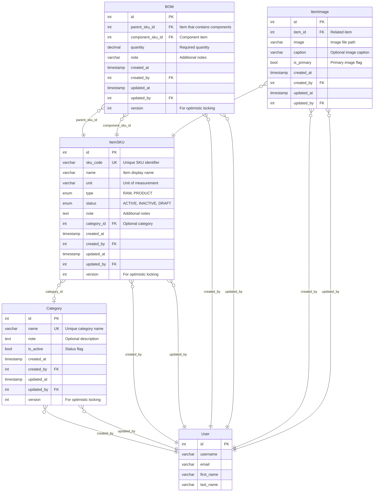

# Catalog Context - Entity Relationship Diagram

## Key Relationships and Business Rules

### **Category -> ItemSKU**
- **Relationship**: One-to-Many (Optional)
- **Business Rule**: Items can optionally belong to a category
- **Notes**: Category can be null, allowing items without categorization

### **ItemSKU -> BOM (as Parent)**
- **Relationship**: One-to-Many
- **Business Rule**: Only PRODUCT and PACKAGE type items can have BOM
- **Notes**: RAW materials cannot have sub-components

### **ItemSKU -> BOM (as Component)**
- **Relationship**: One-to-Many
- **Business Rule**: All item types can be used as components
- **Notes**: Enables flexible BOM structures

### **ItemSKU -> ItemImage**
- **Relationship**: One-to-Many
- **Business Rule**: Items can have multiple images with one primary
- **Notes**: Primary image used for display purposes

### **Audit Trail**
- **All entities include**: created_by, created_at, updated_by, updated_at
- **Optimistic Locking**: version field for concurrent update protection
- **User Tracking**: Full audit trail of who created/modified records

## Entity Constraints

### **ItemSKU**
- `sku_code`: Unique, required
- `type`: Cannot be changed once set
- `status`: Controls item visibility and usage

### **Category**
- `name`: Unique, required
- `is_active`: Controls category availability

### **BOM**
- Unique constraint on (parent_sku_id, component_sku_id)
- Circular reference prevention
- Quantity must be positive

### **ItemImage**
- Only one primary image per item
- Image file validation for supported formats

## Database Indexes

### **Performance Indexes**
- ItemSKU: sku_code, type, status, created_at
- Category: name, is_active
- BOM: parent_sku_id, component_sku_id
- ItemImage: item_id, is_primary

This ERD represents the complete catalog context with proper relationships, constraints, and business rules for the StockFlow inventory management system.
