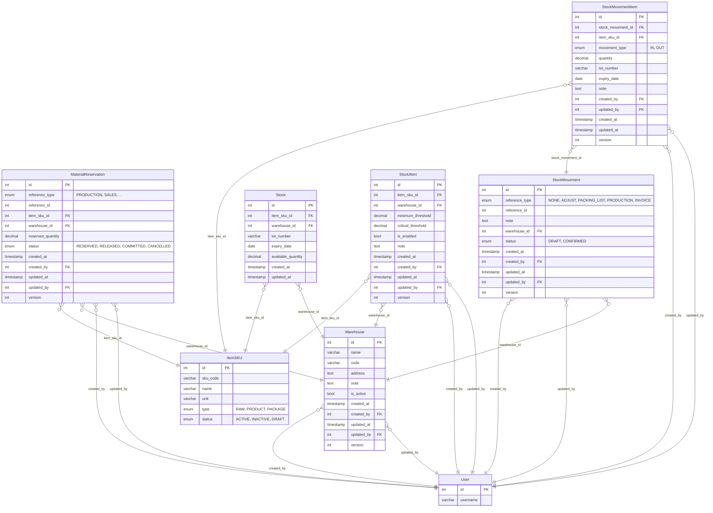

```mermaid
erDiagram
    %% Material Reservation Entity (for production order reservation)
    MaterialReservation {
        int id PK
        enum reference_type "PRODUCTION, SALES, ..."
        int reference_id
        int item_sku_id FK
        int warehouse_id FK
        decimal reserved_quantity
        enum status "RESERVED, RELEASED, COMMITTED, CANCELLED"
        timestamp created_at
        int created_by FK
        timestamp updated_at
        int updated_by FK
        int version
    }
    %% reference_type/reference_id ใช้สำหรับรองรับ context การจองหลายแบบ เช่น ProductionOrder, SalesOrder ฯลฯ
    MaterialReservation }o--|| ItemSKU : "item_sku_id"
    MaterialReservation }o--|| Warehouse : "warehouse_id"
    MaterialReservation }o--|| User : "created_by"
    MaterialReservation }o--|| User : "updated_by"
    %% Inventory Context - Updated to current StockFlow structure
    
    StockMovement {
        int id PK
        enum reference_type "NONE, ADJUST, PACKING_LIST, PRODUCTION, INVOICE"
        int reference_id
        text note
        int warehouse_id FK
        enum status "DRAFT, CONFIRMED"
        timestamp created_at
        int created_by FK
        timestamp updated_at
        int updated_by FK
        int version
    }
    StockMovement }o--|| User : "created_by"
    StockMovement }o--|| User : "updated_by"
    StockMovement }o--|| Warehouse : "warehouse_id"

    StockMovementItem {
        int id PK
        int stock_movement_id FK
        int item_sku_id FK
        enum movement_type "IN, OUT"
        decimal quantity
        varchar lot_number
        date expiry_date
        text note
        int created_by FK
        int updated_by FK
        timestamp created_at
        timestamp updated_at
        int version
    }
    StockMovementItem }o--|| ItemSKU : "item_sku_id"
    StockMovementItem }o--|| StockMovement : "stock_movement_id"
    StockMovementItem }o--|| User : "created_by"
    StockMovementItem }o--|| User : "updated_by"
    
    Warehouse {
        int id PK
        varchar name
        varchar code
        text address
        text note
        bool is_active
        timestamp created_at
        int created_by FK
        timestamp updated_at
        int updated_by FK
        int version
    }
    Warehouse }o--|| User : "created_by"
    Warehouse }o--|| User : "updated_by"
    
    %% Future Stock Entity (for FEFO/FIFO implementation)
    Stock {
        int id PK
        int item_sku_id FK
        int warehouse_id FK
        varchar lot_number
        date expiry_date
        decimal available_quantity
        timestamp created_at
        timestamp updated_at
    }
    Stock }o--|| ItemSKU : "item_sku_id"
    Stock }o--|| Warehouse : "warehouse_id"
    
    %% Stock Alert Configuration
    StockAlert {
        int id PK
        int item_sku_id FK
        int warehouse_id FK
        decimal minimum_threshold
        decimal critical_threshold
        bool is_enabled
        text note
        timestamp created_at
        int created_by FK
        timestamp updated_at
        int updated_by FK
        int version
    }
    StockAlert }o--|| ItemSKU : "item_sku_id"
    StockAlert }o--|| Warehouse : "warehouse_id"
    StockAlert }o--|| User : "created_by"
    StockAlert }o--|| User : "updated_by"
    
    %% External Context Entities
    ItemSKU {
        int id PK
        varchar sku_code
        varchar name
        varchar unit
        enum type "RAW, PRODUCT, PACKAGE"
        enum status "ACTIVE, INACTIVE, DRAFT"
    }
    
    User {
        int id PK
        varchar username
    }
```
