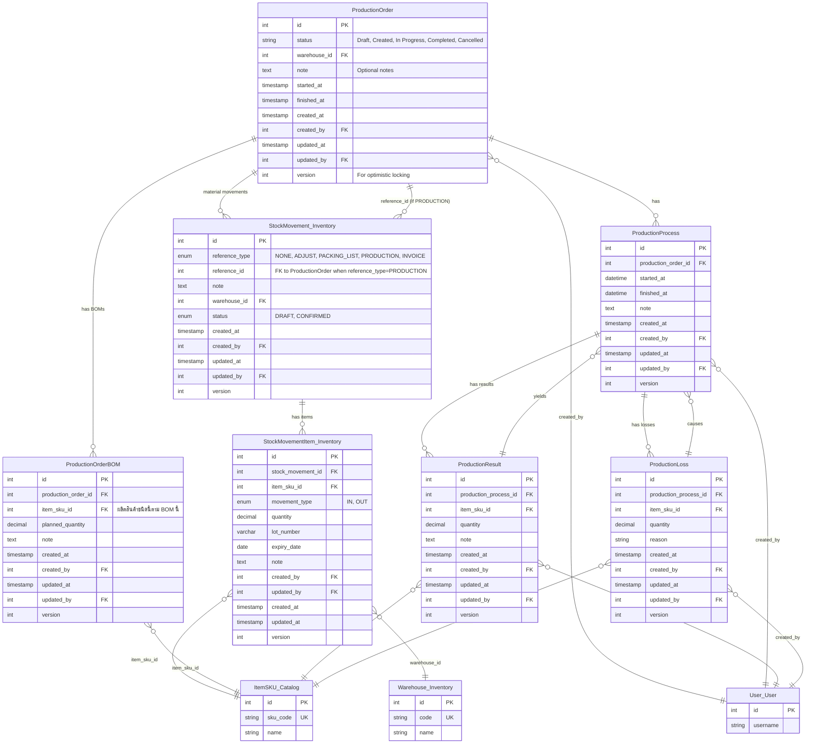

# Production Context ERD

## Key Relationships and Business Rules

### **ProductionOrder -> ProductionMaterialWithdraw / ProductionProcess / ProductionResult / ProductionLoss**
- **Relationship**: One-to-Many
- **Business Rule**: ทุกกิจกรรมต้องอ้างอิง ProductionOrder เสมอ
- **Notes**: ใช้สำหรับ track กระบวนการผลิตและผลลัพธ์

### **ProductionOrder -> BOM**
- **Relationship**: Many-to-One
- **Business Rule**: ต้องเลือก BOM ที่ใช้ในการผลิตแต่ละ order

### **ProductionMaterialWithdraw -> ItemSKU / Warehouse**
- **Relationship**: Many-to-One
- **Business Rule**: การเบิกวัสดุต้องระบุ item และ warehouse
- **Notes**: รองรับ partial withdraw

### **ProductionResult -> ItemSKU / Warehouse**
- **Relationship**: Many-to-One
- **Business Rule**: ผลิตภัณฑ์ที่ผลิตเสร็จต้องระบุ item และ warehouse ที่จัดเก็บ

### **ProductionLoss -> ItemSKU**
- **Relationship**: Many-to-One
- **Business Rule**: ต้องบันทึกเหตุผลและปริมาณวัสดุที่สูญเสีย

### **Audit Trail**
- **All entities include**: created_by, created_at, version
- **Optimistic Locking**: version field for concurrent update protection
- **User Tracking**: Full audit trail of who created/modified records

## Entity Constraints

### **ProductionOrder**
- `status`: Enum, only allowed values
- `version`: Optimistic locking

### **ProductionMaterialWithdraw / ProductionResult / ProductionLoss**
- `quantity`: Must be positive
- `item_sku_id`, `warehouse_id`: FK, required

### **ProductionProcess**
- `process_date`: Required

### **BOM**
- ต้องมีความสัมพันธ์กับ ProductionOrder

## Database Indexes

### **Performance Indexes**
- ProductionOrder: status, created_at
- ProductionMaterialWithdraw: production_order_id, item_sku_id, warehouse_id
- ProductionResult: production_order_id, item_sku_id, warehouse_id
- ProductionLoss: production_order_id, item_sku_id

---
โครงสร้างนี้แสดงความสัมพันธ์, constraints, business rules และ audit trail สำหรับ Production Context ในระบบ StockFlow
