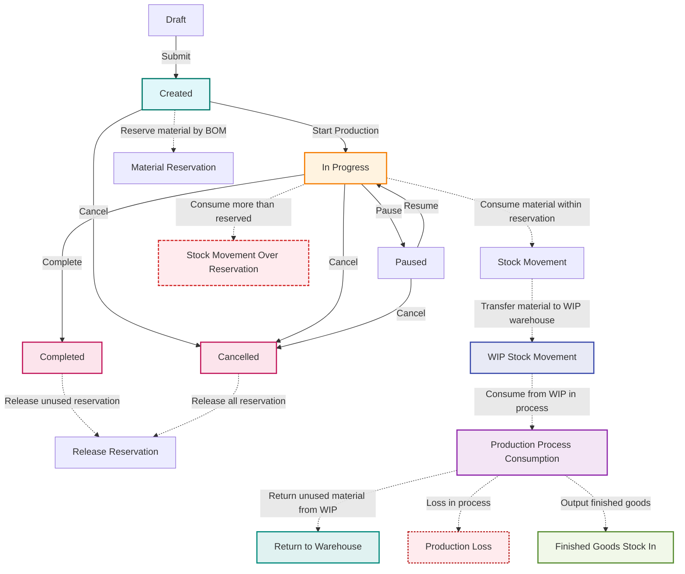

# Production Order Material Reservation Flow

> หมายเหตุ:
> - Created: จองวัสดุตาม BOM
> - In Progress: เบิกวัสดุจริง (เบิกเท่าไหร่ก็ได้)
> - หากเบิกเกินที่จอง จะลด stock จริงโดยตรง (Stock Movement (Over Reservation))
> - Completed/Cancelled: คืนวัสดุที่จองไว้ (ถ้ามี)

---
**WIP/Production Process Flow เพิ่มเติม:**
- In Progress: วัสดุที่เบิกจะถูกโอนเข้า WIP warehouse เฉพาะของ production order/process
- ในแต่ละ production process จะตัด stock ออกจาก WIP warehouse ตามการใช้จริง
- หากมีวัสดุเหลือใน WIP เมื่อ production เสร็จหรือยกเลิก สามารถคืนเข้าคลังจริงได้
- ผลผลิตที่ได้จะถูกโอนเข้าคลังปลายทาง (Finished Goods)
- กรณีสูญเสียวัสดุใน process ให้บันทึกเป็น Production Loss
