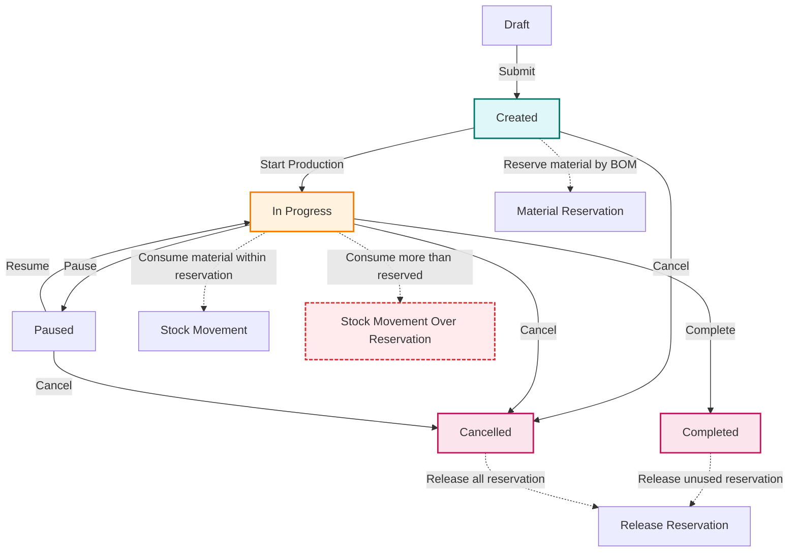

# Production Order Material Reservation Flow

> หมายเหตุ:
> - Created: จองวัสดุตาม BOM
> - In Progress: เบิกวัสดุจริง (เบิกเท่าไหร่ก็ได้)
> - หากเบิกเกินที่จอง จะลด stock จริงโดยตรง (Stock Movement (Over Reservation))
> - Completed/Cancelled: คืนวัสดุที่จองไว้ (ถ้ามี)
