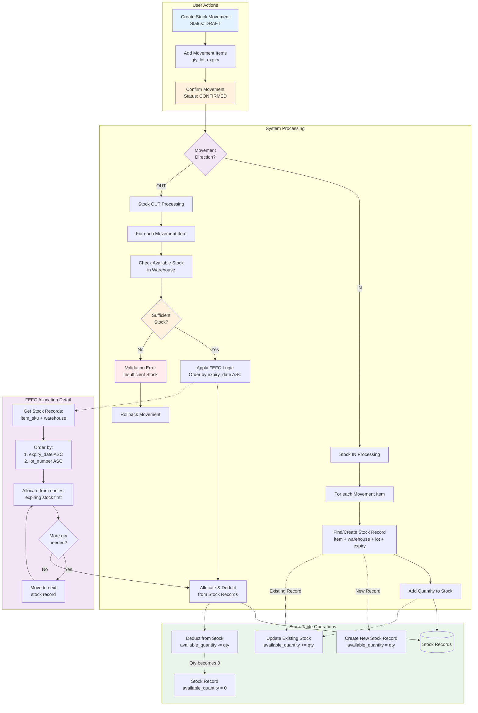
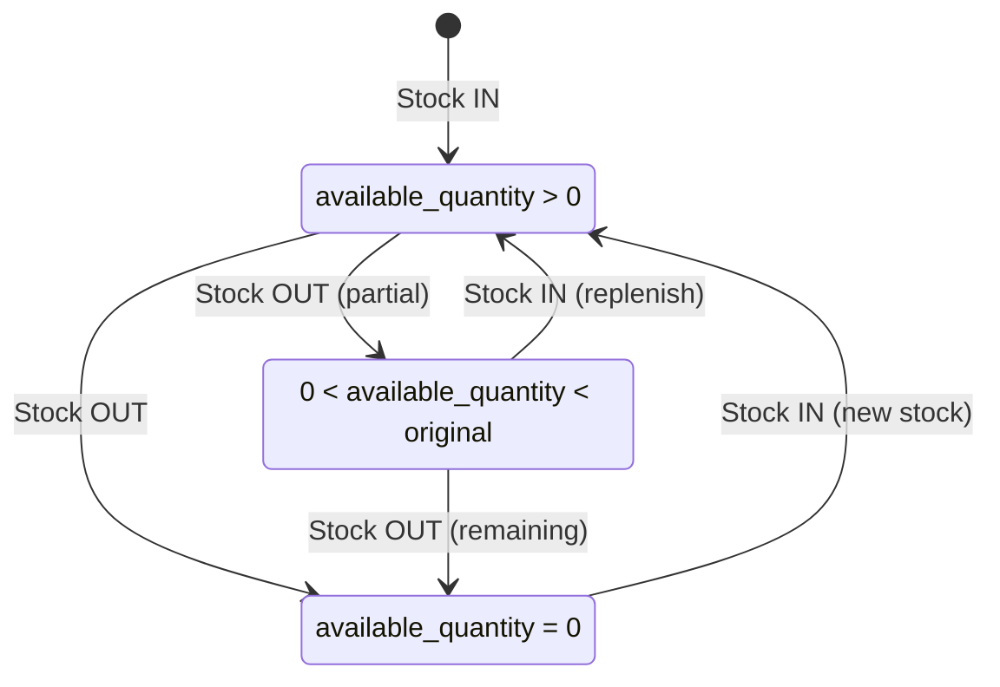

# Stock Movement and Stock Integration Flow



## Key Integration Points

### 1. Data Flow
```
StockMovement (Intent) → StockMovementItem (Details) → Stock (Actual Balance)
```

### 2. Relationship Mapping
- **One StockMovement** has **Many StockMovementItems**
- **One StockMovementItem** affects **One or More Stock Records** (for OUT movements)
- **One Stock Record** represents unique combination of: `item_sku + warehouse + lot_number + expiry_date`

### 3. FEFO Implementation
```python
# When processing Stock OUT movement item:
stock_records = Stock.objects.filter(
    item_sku=movement_item.item_sku,
    warehouse=movement.warehouse,
    available_quantity__gt=0
).order_by('expiry_date', 'lot_number')

# Allocate from earliest expiring stock first
remaining_qty = movement_item.quantity
for stock in stock_records:
    if remaining_qty <= 0:
        break
    
    allocated = min(stock.available_quantity, remaining_qty)
    stock.deduct_quantity(allocated)
    remaining_qty -= allocated
```

### 4. Stock Record States

