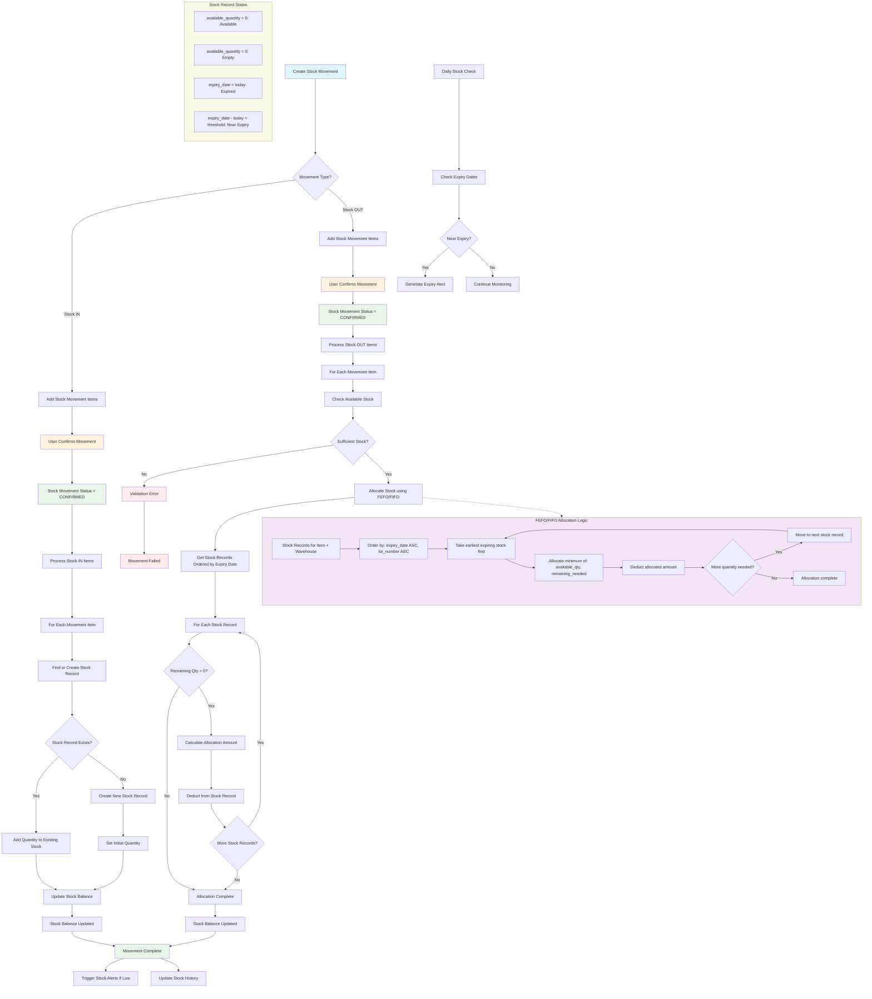
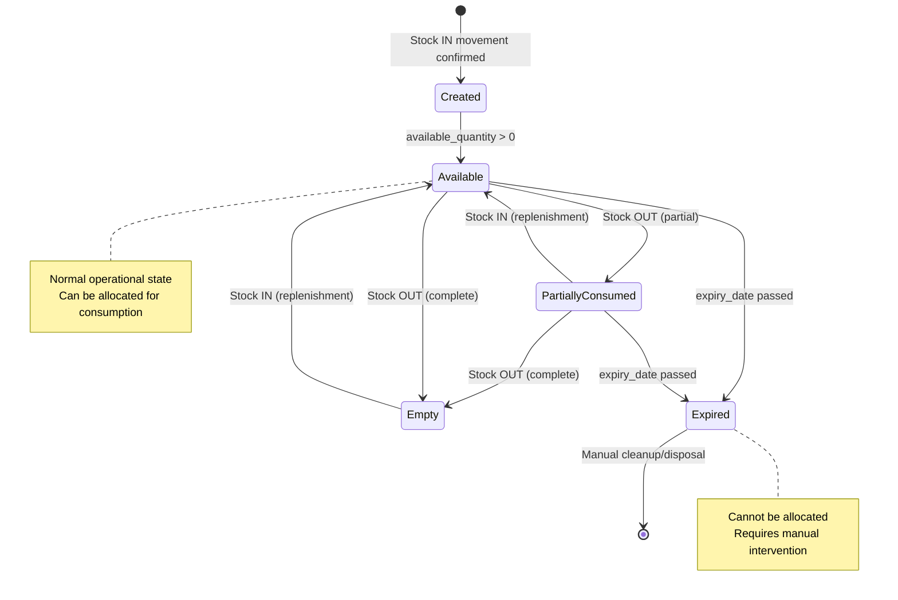

# Stock Management Flow

## Overview
This document describes the flow of stock management in the StockFlow system, showing how StockMovement and Stock models interact during inventory operations.

## Stock Management Flowchart



## Process Description

### 1. Stock Movement Creation
- User creates a new stock movement (DRAFT status)
- Adds movement items with quantities, lot numbers, and expiry dates
- Movement can be IN (receiving stock) or OUT (consuming stock)

### 2. Stock IN Process (Receiving Inventory)
When a stock movement is confirmed for incoming stock:
1. **Find or Create Stock Records**: For each movement item, system looks for existing stock record with same item_sku, warehouse, lot_number, and expiry_date
2. **Add Quantity**: If record exists, add quantity to available_quantity. If not, create new stock record
3. **Update Balances**: Stock balances are updated immediately

### 3. Stock OUT Process (Consuming Inventory)
When a stock movement is confirmed for outgoing stock:
1. **Check Availability**: Verify sufficient stock exists for the item in the warehouse
2. **FEFO/FIFO Allocation**: System automatically allocates stock using First Expired, First Out logic:
   - Get all available stock records for the item/warehouse
   - Order by expiry_date (earliest first), then lot_number
   - Allocate from earliest expiring stock first
3. **Deduct Quantities**: Reduce available_quantity from allocated stock records
4. **Validation**: Ensure no negative stock balances

### 4. FEFO/FIFO Logic Details
```python
# Example allocation for 100 units needed:
# Stock Record 1: lot_number="A001", expiry_date="2025-08-01", available_quantity=60
# Stock Record 2: lot_number="A002", expiry_date="2025-08-15", available_quantity=80

# Allocation Result:
# - Take 60 from Record 1 (fully depletes it)
# - Take 40 from Record 2 (leaves 40 remaining)
```

### 5. Business Rules
- **Immutability**: Once confirmed, stock movements cannot be modified
- **FEFO Priority**: Always consume earliest expiring stock first
- **Lot Traceability**: Complete tracking of lot numbers through the system
- **Negative Stock Prevention**: System prevents negative stock balances
- **Audit Trail**: All stock changes are logged with user and timestamp

### 6. Integration Points
- **StockMovement**: Records the intent and approval of stock changes
- **StockMovementItem**: Details of what items and quantities are involved
- **Stock**: Actual inventory balances with lot/expiry tracking
- **ItemSKU**: Product definitions from catalog
- **Warehouse**: Location tracking

## Stock Record Lifecycle


