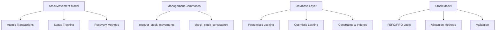
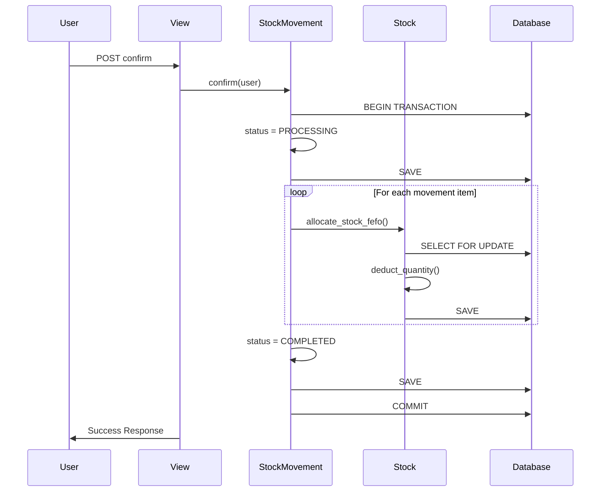

# Technical Implementation Details: Stock Movement Recovery System

## Architecture Overview

### 1. 🏗️ **System Components**



### 2. 🔄 **Transaction Flow**



## 📁 **File Structure และ Code Organization**

### Core Models

```
inventory/models/
├── stock_movement.py          # Main movement model with recovery
├── stock.py                   # Stock records with FEFO/FIFO
├── stock_movement_item.py     # Individual line items
└── warehouse.py               # Warehouse management
```

### Management Commands

```
inventory/management/commands/
├── recover_stock_movements.py     # Recovery operations
└── check_stock_consistency.py     # Data validation
```

### Views และ Forms

```
inventory/views/
├── stock_movement_views.py        # Confirmation views
└── item_views.py                  # Item management

inventory/forms/
└── stock_movement_forms.py        # Validation forms
```

## 🔧 **Implementation Details**

### 1. **StockMovement.confirm() Method**

```python
@transaction.atomic
def confirm(self, confirmed_by):
    """
    Core confirmation method with full error handling
    
    Flow:
    1. Validate pre-conditions
    2. Set PROCESSING status  
    3. Process each movement item
    4. Allocate/Deduct stock using FEFO/FIFO
    5. Set COMPLETED status
    6. Handle any errors → FAILED status
    """
    
    # Pre-validation
    if self.status != self.Status.CONFIRMED:
        raise ValidationError("Can only confirm movements in CONFIRMED status")
    
    if not self.items.exists():
        raise ValidationError("Cannot confirm movement without items")
    
    try:
        # Mark as processing
        self.status = self.Status.PROCESSING
        self.save(update_fields=['status', 'updated_at'])
        
        # Process all stock changes
        self._process_stock_changes(confirmed_by)
        
        # Mark as completed
        self.status = self.Status.COMPLETED
        self.confirmed_at = timezone.now()
        self.confirmed_by = confirmed_by
        self.save(update_fields=['status', 'confirmed_at', 'confirmed_by', 'updated_at'])
        
        # Log success
        logger.info(f"Stock movement {self.id} confirmed successfully")
        
    except Exception as e:
        # Mark as failed and re-raise
        self.status = self.Status.FAILED
        self.save(update_fields=['status', 'updated_at'])
        logger.error(f"Stock movement {self.id} confirmation failed: {str(e)}")
        raise
```

### 2. **Stock Allocation Logic (FEFO)**

```python
@classmethod
def allocate_stock_fefo(cls, item_sku, warehouse, required_quantity, user):
    """
    First Expired, First Out allocation
    
    Key Features:
    - Pessimistic locking (SELECT FOR UPDATE)
    - Atomic operations
    - Automatic stock record creation
    - Version control
    """
    
    allocated_stocks = []
    remaining_quantity = required_quantity
    
    # Get available stock records ordered by expiry date (FEFO)
    stock_records = cls.objects.select_for_update().filter(
        item_sku=item_sku,
        warehouse=warehouse,
        available_quantity__gt=0
    ).order_by('expiry_date', 'created_at')
    
    for stock in stock_records:
        if remaining_quantity <= 0:
            break
            
        # How much can we allocate from this stock record?
        allocation_quantity = min(stock.available_quantity, remaining_quantity)
        
        # Deduct from this stock record
        stock.deduct_quantity(allocation_quantity, user)
        
        allocated_stocks.append({
            'stock': stock,
            'quantity': allocation_quantity
        })
        
        remaining_quantity -= allocation_quantity
    
    if remaining_quantity > 0:
        raise ValidationError(
            f"Insufficient stock for {item_sku.sku_code}. "
            f"Required: {required_quantity}, Available: {required_quantity - remaining_quantity}"
        )
    
    return allocated_stocks
```

### 3. **Recovery Management Command**

```python
class Command(BaseCommand):
    help = 'Recover failed or stuck stock movements'

    def add_arguments(self, parser):
        parser.add_argument('--dry-run', action='store_true')
        parser.add_argument('--movement-id', type=int)
        parser.add_argument('--warehouse-id', type=int)

    def handle(self, *args, **options):
        """
        Main recovery logic:
        1. Find problematic movements
        2. Attempt automatic recovery
        3. Report results
        """
        
        # Build query for problematic movements
        query = Q(status__in=[
            StockMovement.Status.PROCESSING,
            StockMovement.Status.FAILED
        ])
        
        if options['movement_id']:
            query &= Q(id=options['movement_id'])
        if options['warehouse_id']:
            query &= Q(warehouse_id=options['warehouse_id'])
        
        movements = StockMovement.objects.filter(query).order_by('id')
        
        if not movements.exists():
            self.stdout.write(self.style.SUCCESS("No movements need recovery"))
            return
        
        self.stdout.write(f"Found {movements.count()} movements to recover")
        
        if options['dry_run']:
            self._show_dry_run_results(movements)
            return
        
        # Perform actual recovery
        self._perform_recovery(movements)
```

### 4. **Consistency Check Logic**

```python
def _check_item_balance(self, warehouse, item_sku, fix_issues):
    """
    Compare expected vs actual stock balances
    
    Expected Balance = Sum of all COMPLETED movement items
    Actual Balance = Sum of all Stock records
    """
    
    # Calculate expected balance from movements
    expected_balance = Decimal('0.000')
    
    completed_movements = StockMovement.objects.filter(
        warehouse=warehouse,
        status=StockMovement.Status.COMPLETED
    )
    
    for movement in completed_movements:
        movement_items = StockMovementItem.objects.filter(
            stock_movement=movement,
            item_sku=item_sku
        )
        
        for item in movement_items:
            if item.movement_type == 'IN':
                expected_balance += item.quantity
            elif item.movement_type == 'OUT':
                expected_balance -= item.quantity
    
    # Get actual balance
    actual_balance = Stock.get_total_stock(item_sku, warehouse)
    
    # Check for discrepancy
    tolerance = Decimal('0.001')  # Allow small rounding differences
    if abs(expected_balance - actual_balance) > tolerance:
        self._report_balance_mismatch(
            item_sku, expected_balance, actual_balance, fix_issues
        )
        return 1
        
    return 0
```

## 🚨 **Error Handling Strategies**

### 1. **Exception Hierarchy**

```python
# Custom exceptions for different scenarios
class StockMovementError(Exception):
    """Base exception for stock movement operations"""
    pass

class InsufficientStockError(StockMovementError):
    """Raised when not enough stock available"""
    pass

class ConcurrentModificationError(StockMovementError):
    """Raised when record modified by another user"""
    pass

class RecoveryError(StockMovementError):
    """Raised when recovery operation fails"""
    pass
```

### 2. **Logging Strategy**

```python
import logging

logger = logging.getLogger('stockflow.inventory')

# In confirm() method:
logger.info(f"Starting confirmation for movement {self.id}")
logger.debug(f"Processing {self.items.count()} items")

# Error logging:
logger.error(f"Movement {self.id} failed: {str(e)}", exc_info=True)
logger.warning(f"Insufficient stock for SKU {sku_code}")

# Recovery logging:
logger.info(f"Successfully recovered movement {movement.id}")
logger.error(f"Recovery failed for movement {movement.id}: {str(e)}")
```

### 3. **User Feedback**

```python
# In views:
try:
    movement.confirm(request.user)
    messages.success(request, f"Stock movement {movement.id} confirmed successfully")
    
except InsufficientStockError as e:
    messages.error(request, f"Insufficient stock: {str(e)}")
    
except ValidationError as e:
    messages.error(request, f"Validation error: {str(e)}")
    
except Exception as e:
    messages.error(request, "An unexpected error occurred. Please try again.")
    logger.error(f"Unexpected error in movement confirmation: {str(e)}")
```

## 📊 **Performance Considerations**

### 1. **Database Indexes**

```sql
-- Auto-generated by Django
CREATE INDEX "inventory_s_item_sk_392ad3_idx" ON "inventory_stock" ("item_sku_id", "warehouse_id", "expiry_date");
CREATE INDEX "inventory_s_item_sk_06675a_idx" ON "inventory_stock" ("item_sku_id", "warehouse_id", "lot_number");
CREATE INDEX "inventory_s_warehou_af2571_idx" ON "inventory_stock" ("warehouse_id", "item_sku_id");
CREATE INDEX "inventory_s_expiry__b1d30a_idx" ON "inventory_stock" ("expiry_date");
```

### 2. **Query Optimization**

```python
# Use select_related to avoid N+1 queries
movements = StockMovement.objects.select_related(
    'warehouse', 'confirmed_by'
).prefetch_related(
    'items__item_sku'
).filter(status='CONFIRMED')

# Use bulk operations when possible
StockMovement.objects.filter(
    id__in=movement_ids
).update(status=StockMovement.Status.FAILED)
```

### 3. **Transaction Isolation**

```python
# Use appropriate isolation level
from django.db import transaction

@transaction.atomic
def critical_stock_operation():
    # This ensures read committed isolation
    # Prevents dirty reads, allows concurrent access
    pass

# For high-concurrency scenarios:
with transaction.atomic():
    # Use SELECT FOR UPDATE NOWAIT to fail fast on contention
    stock = Stock.objects.select_for_update(nowait=True).get(id=stock_id)
```

## 🔍 **Testing Strategy**

### 1. **Unit Tests**

```python
class StockMovementConfirmTest(TestCase):
    
    def test_successful_confirmation(self):
        """Test normal confirmation flow"""
        
    def test_insufficient_stock_error(self):
        """Test behavior when not enough stock"""
        
    def test_concurrent_confirmation_prevention(self):
        """Test pessimistic locking prevents race conditions"""
        
    def test_transaction_rollback_on_error(self):
        """Test that errors cause complete rollback"""
        
    def test_recovery_from_failed_state(self):
        """Test recovery mechanism"""
```

### 2. **Integration Tests**

```python
class StockMovementIntegrationTest(TransactionTestCase):
    
    def test_power_failure_simulation(self):
        """Simulate system failure during confirmation"""
        with patch('django.db.transaction.atomic', side_effect=Exception):
            # Test recovery mechanisms
            
    def test_deadlock_handling(self):
        """Test deadlock detection and recovery"""
        
    def test_management_command_recovery(self):
        """Test management command functionality"""
```

### 3. **Load Testing**

```python
# Using pytest-django and concurrent.futures
def test_concurrent_confirmations():
    """Test system under concurrent load"""
    
    with ThreadPoolExecutor(max_workers=10) as executor:
        futures = []
        for i in range(100):
            future = executor.submit(confirm_movement, movement_id)
            futures.append(future)
        
        # Check results
        for future in futures:
            result = future.result()
            # Assert expected behavior
```

## 🔮 **Monitoring และ Observability**

### 1. **Metrics Collection**

```python
# Using Django's cache framework for metrics
from django.core.cache import cache

def track_movement_metric(metric_name, value=1):
    """Track stock movement metrics"""
    cache_key = f"stock_movement_metrics:{metric_name}"
    current_value = cache.get(cache_key, 0)
    cache.set(cache_key, current_value + value, timeout=3600)

# Usage:
track_movement_metric('confirmations_success')
track_movement_metric('confirmations_failed')
track_movement_metric('recovery_attempts')
```

### 2. **Health Checks**

```python
def stock_system_health_check():
    """Check system health"""
    health_status = {
        'stuck_movements': 0,
        'failed_movements': 0,
        'avg_processing_time': 0,
        'deadlock_count': 0
    }
    
    # Check for stuck movements
    stuck_count = StockMovement.objects.filter(
        status=StockMovement.Status.PROCESSING,
        updated_at__lt=timezone.now() - timedelta(minutes=5)
    ).count()
    
    health_status['stuck_movements'] = stuck_count
    
    return health_status
```

### 3. **Alerting Integration**

```python
def send_critical_alert(message):
    """Send alert for critical issues"""
    if settings.ENABLE_ALERTS:
        # Integration with external alerting system
        # e.g., Slack, PagerDuty, Email
        pass
        
# Usage in recovery command:
if critical_issues_found > 0:
    send_critical_alert(f"Found {critical_issues_found} critical stock issues")
```

## 🚀 **Deployment Considerations**

### 1. **Database Migration Strategy**

```bash
# Safe migration approach
python manage.py migrate inventory 0005  # Before stock model
python manage.py migrate inventory 0006  # Add stock model
python manage.py check_stock_consistency  # Verify integrity
```

### 2. **Zero-Downtime Deployment**

```bash
# 1. Deploy code with feature flag disabled
# 2. Run migrations
# 3. Enable feature flag
# 4. Monitor system health
```

### 3. **Rollback Plan**

```sql
-- Emergency rollback queries if needed
UPDATE inventory_stockmovement 
SET status = 'CONFIRMED' 
WHERE status = 'PROCESSING' 
AND updated_at < NOW() - INTERVAL '1 hour';
```

---

**Documentation Version**: 1.0  
**Last Updated**: July 30, 2025  
**Author**: Stockflow Development Team
