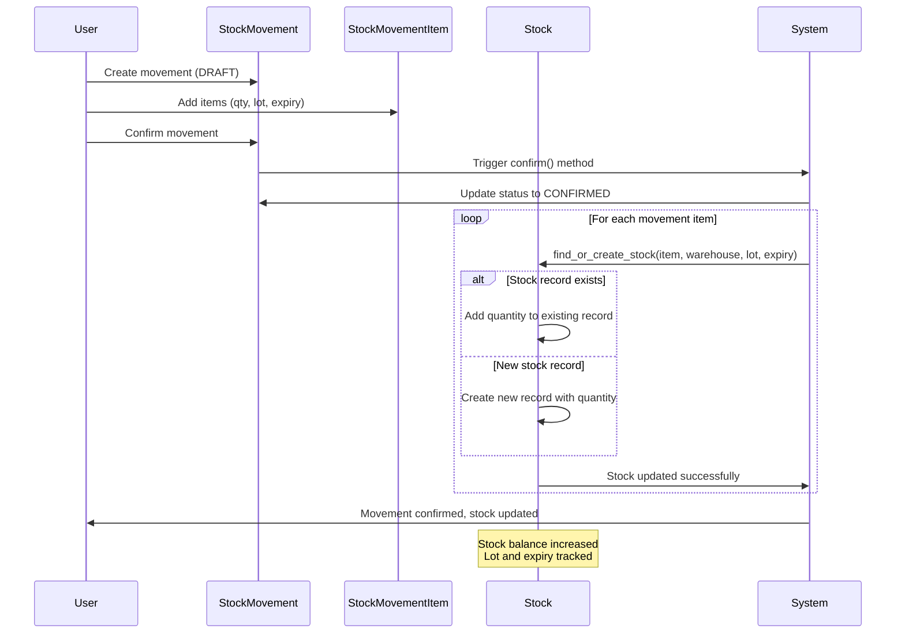
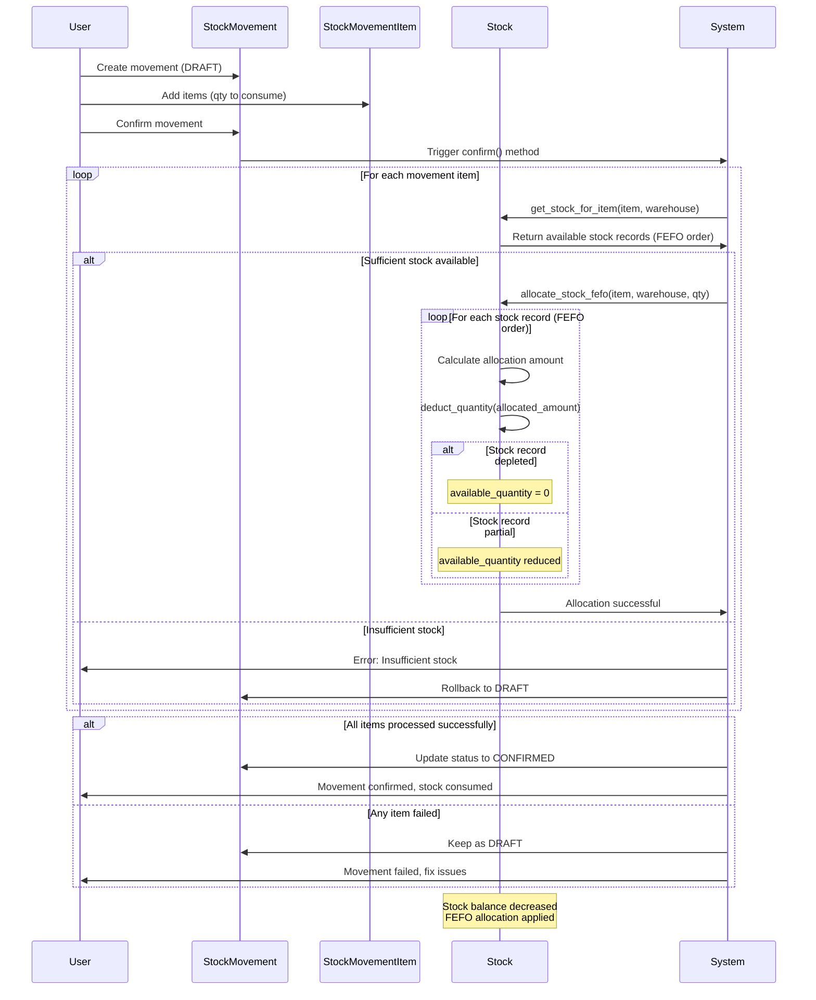
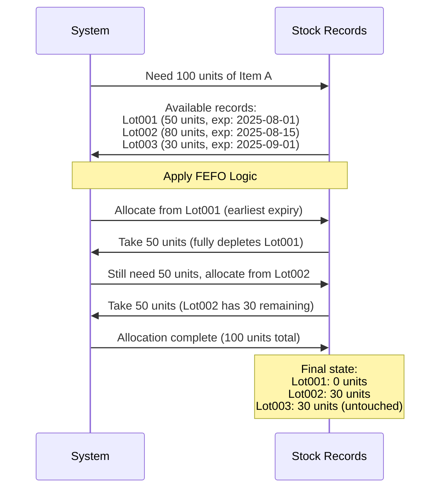
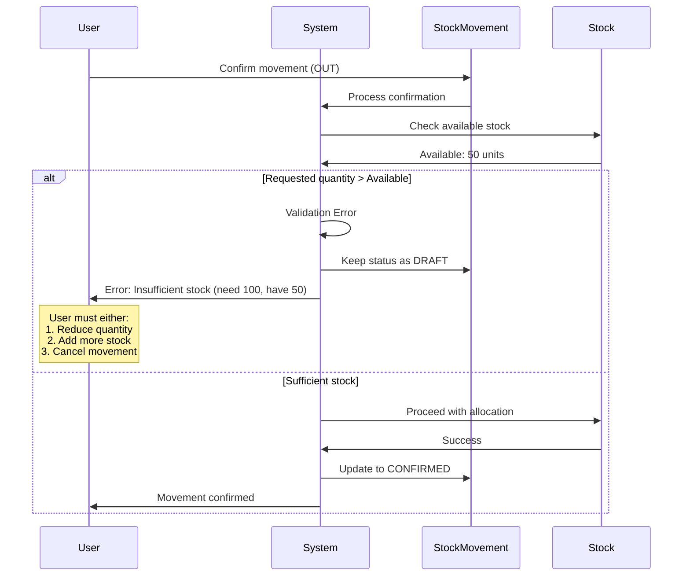
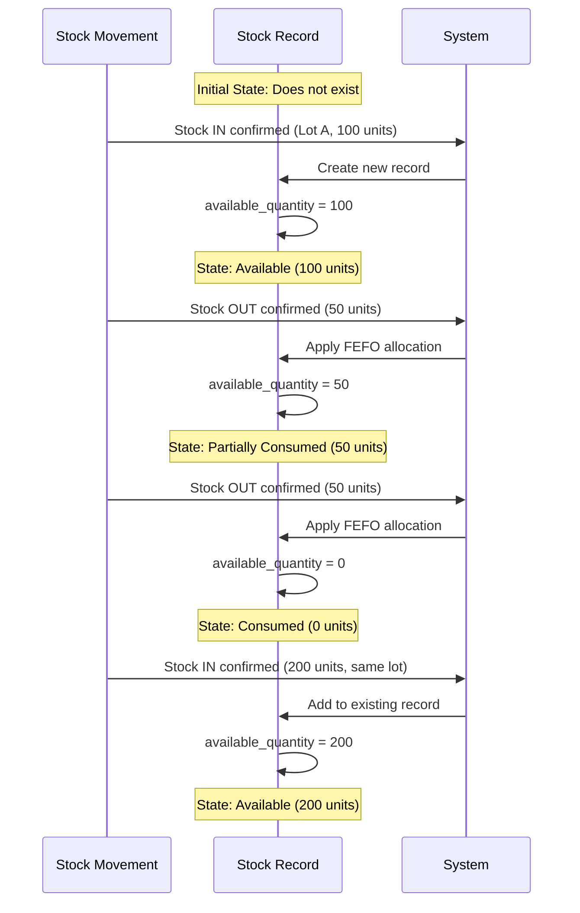

# Stock Management Sequence Diagrams

## Stock IN Sequence (Receiving Inventory)

## Stock OUT Sequence (Consuming Inventory)

## FEFO Allocation Detail

## Error Handling Sequence

## Stock Record Lifecycle

