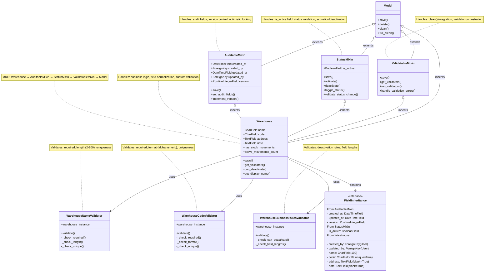

## Warehouse Model Class Diagram

This diagram shows the inheritance hierarchy and relationships of the Warehouse model:

### **Inheritance Chain (MRO - Method Resolution Order):**
1. **Warehouse** (main model)
2. **AuditableMixin** (audit fields & version control)
3. **StatusMixin** (status management)
4. **ValidatableMixin** (validation orchestration)
5. **Model** (Django base model)

### **Mixin Responsibilities:**

#### 🔍 **AuditableMixin**
- Provides audit fields: `created_at`, `created_by`, `updated_at`, `updated_by`, `version`
- Handles optimistic locking via version field
- Automatically sets audit fields on save

#### 📊 **StatusMixin**
- Provides `is_active` field
- Handles activation/deactivation logic
- Validates status changes

#### ✅ **ValidatableMixin**
- Integrates with Django's `clean()` method
- Orchestrates multiple validators
- Handles validation error formatting

#### 🏭 **Warehouse Model**
- Contains core business fields
- Implements domain-specific business logic
- Normalizes data (code to uppercase)
- Provides helper methods and properties

### **Validation Strategy:**
The Warehouse uses **composition over inheritance** for validators:
- **WarehouseNameValidator**: Name requirements & uniqueness
- **WarehouseCodeValidator**: Code format & uniqueness  
- **WarehouseBusinessRulesValidator**: Business constraints

### **Key Benefits:**
1. **Single Responsibility**: Each mixin has one clear purpose
2. **Reusability**: Mixins can be used by other models
3. **Testability**: Each component can be tested independently
4. **Maintainability**: Changes isolated to specific concerns
5. **Domain Boundaries**: Validators stay within inventory domain
