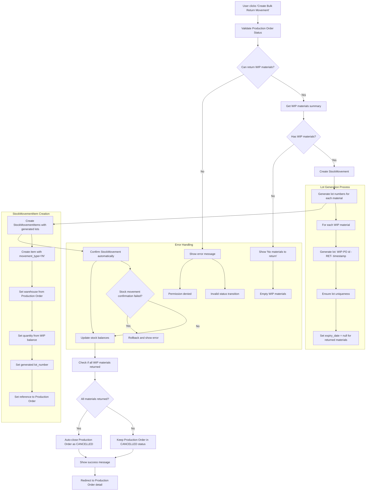
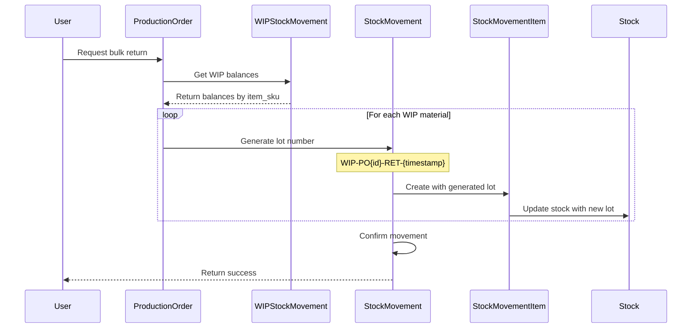

# WIP Materials Return with Lot Tracking

## Overview
การจัดการ lot number เมื่อ return WIP materials กลับไปยัง inventory โดยใช้แนวทาง Auto-generate lot numbers เพื่อรักษา traceability ผ่าน production order

## Problem Statement
### ปัญหาที่พบ:
1. `WIPStockMovement` ไม่ได้เก็บ `lot_number` แต่ `StockMovementItem` จำเป็นต้องมี lot number
2. เมื่อ return WIP materials กลับเป็น stock ปกติ ระบบต้องระบุ lot number 
3. วัตถุดิบตัวเดียวกันอาจมาจากหลาย lots และ mixed กันใน WIP
4. การ return ต้องสร้าง lot ใหม่เพราะไม่สามารถ track lot เดิมได้

## Solution: Auto-generate Lot Numbers

### แนวคิด:
- สร้าง lot number ใหม่สำหรับ WIP materials ที่ return
- ใช้ production order ID เป็น reference เพื่อ traceability
- Format: `WIP-PO{production_order_id}-RET-{timestamp}`

### ประโยชน์:
- ไม่ต้องแก้ไข `WIPStockMovement` model
- เก็บ traceability ได้ผ่าน production order ID
- Implementation ง่าย และไม่ซับซ้อน
- รองรับ audit trail

## Implementation Flow



## Lot Number Generation Strategy

### Format Pattern:
```
WIP-PO{production_order_id}-RET-{timestamp}
```

### Examples:
- `WIP-PO001-RET-20250910143022` (Production Order #1, returned on 2025-09-10 14:30:22)
- `WIP-PO025-RET-20250910143045` (Production Order #25, returned on 2025-09-10 14:30:45)

### Generation Rules:
1. **Prefix**: `WIP-` เพื่อระบุว่ามาจาก WIP materials
2. **Production Order Reference**: `PO{id}` เพื่อ link กลับไป production order
3. **Operation**: `RET` เพื่อระบุว่าเป็นการ return
4. **Timestamp**: `YYYYMMDDHHMMSS` เพื่อความ unique และ audit trail
5. **Uniqueness Check**: ตรวจสอบว่า lot number ไม่ซ้ำในระบบ

## Database Changes

### No Schema Changes Required
- ไม่ต้องแก้ไข `WIPStockMovement` model
- ใช้ existing `StockMovementItem.lot_number` field
- ไม่ต้องทำ migration

### Data Flow:
1. `WIPStockMovement` → aggregate balance โดย `item_sku`
2. Generate lot number for return
3. Create `StockMovementItem` with generated lot
4. Update `Stock` table with new lot records

## Business Logic

### When to Generate Lots:
- เมื่อทำ bulk return WIP materials
- เมื่อ individual return (future enhancement)
- เมื่อ manual return ผ่าน stock movement creation

### Lot Traceability:


## Implementation Details

### Function: `generate_wip_return_lot_number()`
```python
def generate_wip_return_lot_number(production_order_id):
    """
    Generate unique lot number for WIP material return
    
    Args:
        production_order_id (int): Production order ID
        
    Returns:
        str: Generated lot number in format WIP-PO{id}-RET-{timestamp}
    """
    from datetime import datetime
    from inventory.models import StockMovementItem
    
    # Generate base lot number
    timestamp = datetime.now().strftime('%Y%m%d%H%M%S')
    base_lot = f"WIP-PO{production_order_id:03d}-RET-{timestamp}"
    
    # Ensure uniqueness (in case of concurrent requests)
    lot_number = base_lot
    counter = 1
    while StockMovementItem.objects.filter(lot_number=lot_number).exists():
        lot_number = f"{base_lot}-{counter:02d}"
        counter += 1
        
    return lot_number
```

### Error Handling:
1. **Duplicate Lot Numbers**: ใช้ counter suffix
2. **Empty WIP Materials**: แสดง warning message
3. **Stock Movement Failure**: Rollback และแสดง error
4. **Production Order Status**: ตรวจสอบสถานะก่อน return

## Testing Strategy

### Unit Tests:
1. **Lot Generation Tests**:
   - Test lot number format
   - Test uniqueness handling
   - Test concurrent generation

2. **Return Process Tests**:
   - Test bulk return with multiple materials
   - Test empty WIP materials
   - Test invalid production order status

3. **Integration Tests**:
   - Test end-to-end return process
   - Test stock balance updates
   - Test production order closure

### Test Cases:
```python
def test_generate_lot_number_format():
    """Test lot number follows correct format"""
    
def test_generate_lot_number_uniqueness():
    """Test lot number uniqueness handling"""
    
def test_bulk_return_creates_correct_lots():
    """Test bulk return generates proper lot numbers"""
    
def test_stock_balance_after_return():
    """Test stock balances are updated correctly"""
```

## Audit and Traceability

### Audit Trail:
1. **StockMovement**: บันทึก reference กลับไป production order
2. **StockMovementItem**: เก็บ lot number และ quantity
3. **Stock**: สร้าง records ใหม่สำหรับ returned materials
4. **Production Order**: log การ return และ closure

### Reporting Capabilities:
- ค้นหา materials ที่ return จาก production order ใดได้
- Track lot numbers ที่เกิดจาก WIP returns
- Audit trail ของการเปลี่ยนสถานะ production order

## Future Enhancements

### Phase 2 Features:
1. **Individual Material Return**: Return วัตถุดิบทีละรายการ
2. **Partial Quantity Return**: Return บางส่วนของ WIP material
3. **Lot Selection UI**: ให้ user เลือก lot number manual (optional)
4. **Return Reason Tracking**: บันทึกเหตุผลการ return

### Advanced Lot Tracking:
1. **WIP Lot History**: เก็บ lot ต้นทางใน WIPStockMovement (future model change)
2. **Lot Reconciliation**: เปรียบเทียบ lot เดิมกับ lot ที่ return
3. **Batch Return Reports**: รายงานการ return แบบ batch

## Configuration

### Settings:
```python
# settings.py
WIP_RETURN_LOT_FORMAT = "WIP-PO{production_order_id:03d}-RET-{timestamp}"
WIP_RETURN_AUTO_CLOSE_ORDER = True
WIP_RETURN_DEFAULT_EXPIRY_DAYS = None  # No expiry for returned materials
```

### Customization:
- Lot number format สามารถปรับแต่งได้ผ่าน settings
- Auto-close behavior สามารถ toggle ได้
- Expiry date handling สามารถกำหนดได้

## Summary

แนวทาง Auto-generate lot numbers เป็นวิธีแก้ปัญหาที่:
- **เรียบง่าย**: ไม่ต้องแก้ไข existing models
- **มีประสิทธิภาพ**: รองรับ bulk operations
- **Traceable**: เก็บ audit trail ได้ดี
- **Flexible**: สามารถปรับแต่งและขยายได้ในอนาคต

การใช้ production order ID เป็น reference ทำให้สามารถ trace กลับไปหา production order ต้นทางได้ และ timestamp ช่วยให้ unique และ audit ได้ดี
