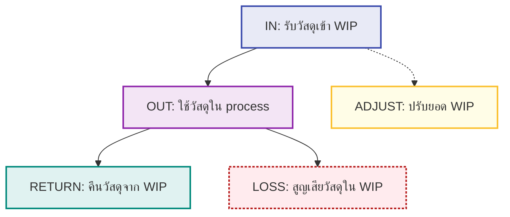

# WIPStockMovement Event Flow

---
**WIPStockMovement Event Flow:**
- **IN**: รับวัสดุเข้า WIP (จาก stock จริง)
- **OUT**: ใช้วัสดุใน process (ตัดออกจาก WIP)
- **RETURN**: คืนวัสดุจาก WIP กลับคลังจริง
- **LOSS**: สูญเสียวัสดุใน WIP
- **ADJUST**: ปรับยอด WIP (เช่น audit, correction)
