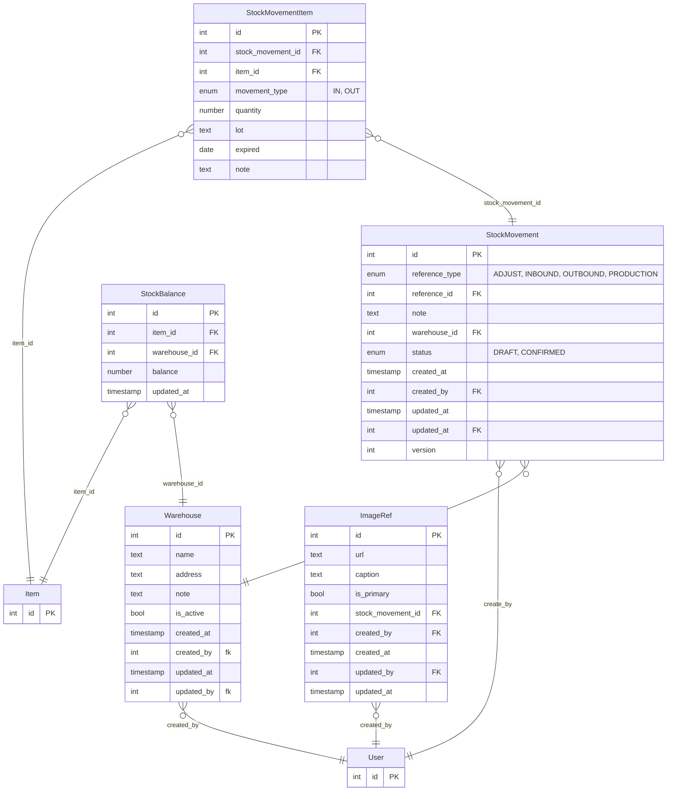
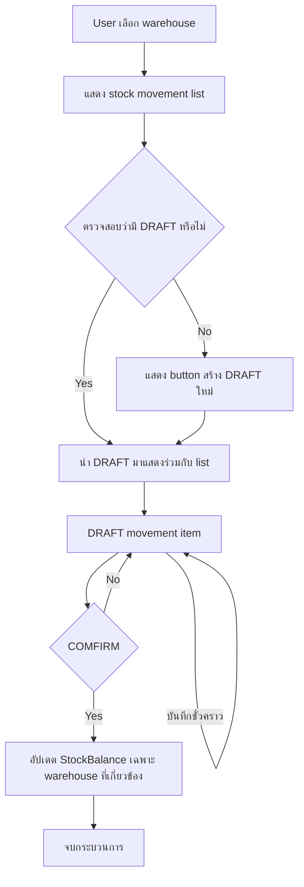

```mermaid
erDiagram
    %% not allow one movement to many warehouse
    StockMovement {
        int id PK
        enum reference_type "ADJUST, INBOUND, OUTBOUND, PRODUCTION"
        int reference_id FK
        text note
        int warehouse_id FK
        enum status "DRAFT, CONFIRMED"
        timestamp created_at
        int created_by FK
        timestamp updated_at
        int updated_at FK
        int version
    }
    StockMovement }o--|| User : "create_by"
    StockMovement }o--|| Warehouse : "warehouse_id"

    StockMovementItem {
        int id PK
        int stock_movement_id FK
        int item_id FK
        enum movement_type "IN, OUT"
        number quantity
        text lot
        date expired
        text note      
    }
    StockMovementItem }o--|| Item : "item_id" 
    StockMovementItem }o--|| StockMovement : "stock_movement_id"

    StockBalance {
        int id PK
        int item_id FK
        int warehouse_id FK
        number balance
        timestamp updated_at
    }
    StockBalance }o--|| Item : "item_id"
    StockBalance }o--|| Warehouse : "warehouse_id"

    ImageRef {
	    int id PK
	    text url
	    text caption
	    bool is_primary
	    int stock_movement_id FK
	    int created_by FK
	    timestamp created_at
	    int updated_by FK
	    timestamp updated_at
    }
    ImageRef }o--|| User : "created_by"
    
    Warehouse {
        int id PK
        text name
        text address
        text note
        bool is_active
        timestamp created_at
	    int created_by fk
	    timestamp updated_at
	    int updated_by fk
    }
    Warehouse }o--|| User : "created_by"
    
    %% outter context
    Item {
      int id PK
    }
    User {
	    int id PK
    }
```

```mermaid
flowchart TD
    A[User เลือก warehouse] --> I[แสดง stock movement list]
    I --> B{ตรวจสอบว่ามี DRAFT หรือไม่}
    B -- Yes --> C[นำ DRAFT มาแสดงร่วมกับ list ]
    B -- No --> D[แสดง button สร้าง DRAFT ใหม่]
    D --> C
    C --> E[DRAFT movement item]
    E -->|บันทึกชั่วคราว| E
    E --> F{COMFIRM}
    F -- Yes --> G[อัปเดต StockBalance เฉพาะ warehouse ที่เกี่ยวข้อง]
    F -- No --> E
    G --> H[จบกระบวนการ]
```