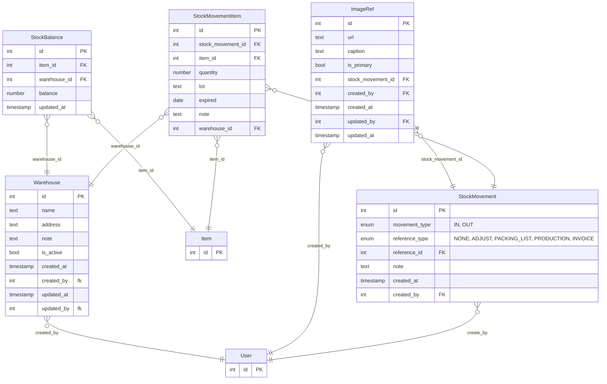

```mermaid
erDiagram
    StockMovement {
        int id PK
        enum movement_type "IN, OUT"
        enum reference_type "NONE, ADJUST, PACKING_LIST, PRODUCTION, INVOICE"
        int reference_id FK
        text note
        timestamp created_at
        int created_by FK
    }
    StockMovement }o--|| User : "create_by"

    StockMovementItem {
        int id PK
        int stock_movement_id FK
        int item_id FK
        number quantity
        text lot
        date expired
        text note
        int warehouse_id FK
    }
    StockMovementItem }o--|| Item : "item_id"
    StockMovementItem }o--|| Warehouse : "warehouse_id"
    StockMovementItem }o--|| StockMovement : "stock_movement_id"

    StockBalance {
        int id PK
        int item_id FK
        int warehouse_id FK
        number balance
        timestamp updated_at
    }
    StockBalance }o--|| Item : "item_id"
    StockBalance }o--|| Warehouse : "warehouse_id"

    ImageRef {
	    int id PK
	    text url
	    text caption
	    bool is_primary
	    int stock_movement_id FK
	    int created_by FK
	    timestamp created_at
	    int updated_by FK
	    timestamp updated_at
    }
    ImageRef }o--|| StockMovement : "stock_movement_id"
    ImageRef }o--|| User : "created_by"
    
    Warehouse {
        int id PK
        text name
        text address
        text note
        bool is_active
        timestamp created_at
	    int created_by fk
	    timestamp updated_at
	    int updated_by fk
    }
    Warehouse }o--|| User : "created_by"
    
    %% outter context
    Item {
      int id PK
    }
    User {
	    int id PK
    }
```